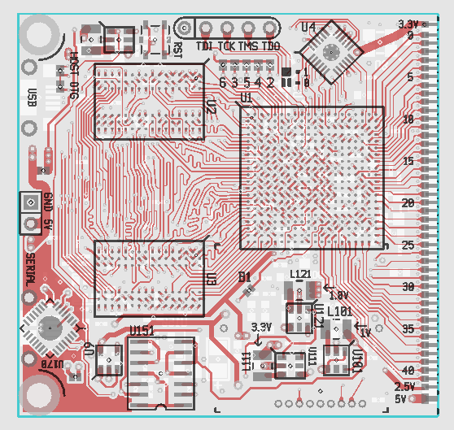

# SDR based comms experimentation platform

**zynq_som_2** - a simple SoM with Zynq-7010, 32 bit DDR3, and 40 GPIOs. Used to verify layout design of Zynq and DDR3.

* 4 layer board
* 5cm x 5cm
* prototyped and verified

**sdr5_2** - a Zynq + AD9363 SDR platform, layout based on zynq_som_2.
* Bringup progress:
  * Zynq + DDR, Linux, memtest: working
  * AD9363 receive and transmit: working
  * Power amplifiers: TBD
  * LNA + filters: TBD
  * Ethernet: TBD
* Errata:
  * AD9363 main 1.3V rail is powered by a AP3419 buck converter. It does not exit pulse skipping mode at the typical RX current consumption, adding significant phase noise (-30dBc spurs). Workaround: solder 2 10ohm resistors from VCC1P3 to ground. TODO: test JW5211 (pin compatible substitute, lower current rating)

* Differences compared to ADALM-PLUTO:
  * Full 32 bits of the DDR3 are routed (for 2x memory bandwidth and 1GB memory)
  * Support for Zynq-7020 and Zynq-7010 in 400pin BGA package
  * Integrated RF frontends (LNA, PA, SAW filter) for two ISM bands (860/915MHz and 2450MHz)
  * Shielding
  * 4 layer board to reduce cost
  * SD slot for running real Linux distros

---
To open schematics, it is necessary to add all gEDA symbols here to your symbol library: https://github.com/gabriel-tenma-white/sym

To edit PCB layouts, make sure "packages" is a symlink to a cloned repository of: https://github.com/gabriel-tenma-white/packages2
